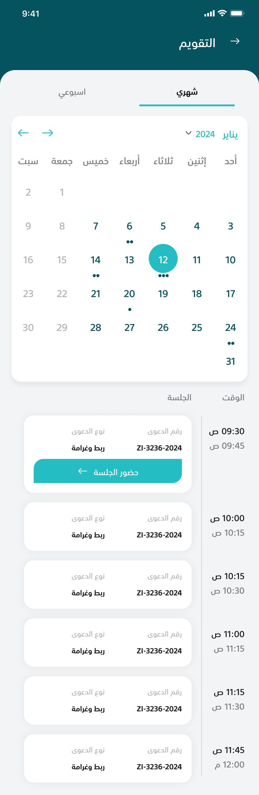
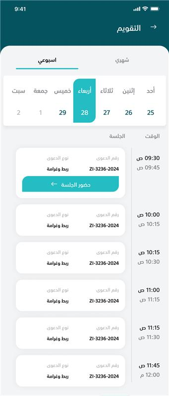

# Nader Mohamed Task

A Flutter project built using **Clean Architecture** principles.  
This project demonstrates a modular, scalable Flutter application structure.

---

## Screenshots

|                 Calendar Month Screen                 |   |                Calendar Week Screen                 |
|:-----------------------------------------------------:|---|:---------------------------------------------------:|
1. |  |   |  |

---

## Features

- Clean Architecture with separation of **Presentation**, **Domain**, and **Data** layers
- State management using **Bloc/Cubit**
- Localization support
- Responsive design for **mobile**, **tablet**, and **desktop**
- Network handling with proper error handling

---

## Packages Used

Here is a list of the main packages used in this project:

- [`flutter_bloc`](https://pub.dev/packages/flutter_bloc) - State management using Bloc/Cubit
- [`get_it`](https://pub.dev/packages/get_it) - Dependency injection
- [`table_calendar`](https://pub.dev/packages/table_calendar) - Calendar widget
- [`reactive_forms`](https://pub.dev/packages/reactive_forms) - Form handling
- [`responsive_framework`](https://pub.dev/packages/responsive_framework) - Responsive design
- [`dio`](https://pub.dev/packages/dio) - Network requests

---

## Getting Started

To run this project locally:

1. Clone the repository:
```bash
git clone https://github.com/NaderMohamedMusa/calendar
